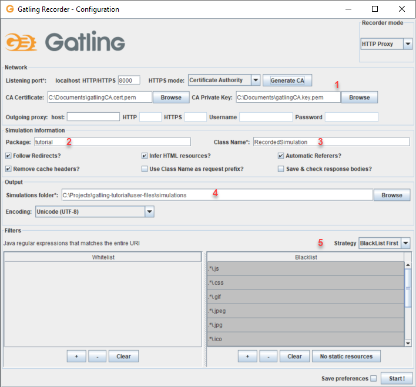

# Gatling-tutorial

The topic of this comprehensive tutorial is how to start performance testing with Gatling.io.

Let's assume that you are pretty new to performance testing but have some experience in testing overall. Great! This place is for you. The purpose of this tutorial is to know the basics around the tool - Gatling.io and its R&R functionality. I will show you how to set up an environment, the tool and explain essentials regarding the recorded scenario.


## Installations

There are required installations needed to start working with Gatling:

	1. Firefox web browser (or other, Gatling supports other browsers too).
	2. Clone or download repository to a folder of your choice (preferably C:\).
	3. Install OpenJDK8.
	4. Scala 2.12.

__Setting up Certificates in Gatling recorder__

While working with the recorder is important to tell your browser that Gatling is not a security threat. More on this [Here](https://gatling.io/docs/current/http/recorder/#https-mode). I use Certificate Authority:

	1. Go to Gatling bundle: %GATLING_HOME%\bin\recorder.bat.
	2. Set HTTPS Mode: Certificate Authority.
	3. Generate CA.
	4. Save files.
	5. Under CA Certificate: Browse and set: gatlingCA.cert.pem.
	6. Unser CA PK set: gatlingCA.key.pem.

__Setting up Firefox Browser__

And now, let's configure certificates and proxy in the browser. The following example regards Firefox, but similar steps can be done in other browsers:

	1. Navigate to Options > Certificates > View Certificates.
	2. Go to Authorities tab.
	3. Import gatlingCA.cert.pem and gatlingCA.key.pem.
	4. Navigate to Options > Network > Settings.
	5. Set it for ‘Manual proxy configuration’.

__Setting up System Environment Variables__

To run Gatling, setting up System Environment Variables is required:

	1. Navigate to System Properties > Advanced > Environment Variables.
	2. Under System Variables select New.
	3. Add the following:
		Variable name: JAVA_HOME.
		Variable value: {path to jdk}.

## Recorder

Read this chapter to understand how Gatling is paired with the browser and how it mimics your steps:

[Link to Gatling/recorder](https://gatling.io/docs/3.3/http/recorder)

Let's run the recorder and proceed further with configuration around the subject.

Run %GATLING_HOME%\bin\recorder.bat

Then you will see the following window:




Let's discuss marked points:

1. Selected HTTPS mode: Certificate Authority.
	That point was discussed in the previous section, but you can align with the example and check whether it is the same.

2. Package: tutorial.
   The name of the package must be added, it's a name of your choice, but remember to be specific when naming things.

3. Class Name: RecorderdSimulation. 
   The default name of the simulation; this one is good; therefore, I don't change it.

4. Simulation folder. 
   The path of the folder where simulations will be stored.

5. Filters section. 
   Let's set up a strategy of our recorder for 'BlackList First' and then select the 'No static resources' button at the bottom. 
   The blacklist column will be filled automatically.

## Recorded script

Now, when all configured, let's record the given steps. We're going to use [automationpractice website](http://automationpractice.com/index.php), which is an online mockup shop. 

First select 'Start!' button and execute:

__The following scenario__

|Step|Description                          |Expected Result                                      |
|----|-------------------------------------|-----------------------------------------------------|
|1|Open the browser and navigate to the website: http://automationpractice.com/index.php|Shop's home page visible|
|2|Type 'dress' in the 'Search' field|The given word displayed|
|3|Hit search button|A list with search results displayed|
|4|Select 'Printed Chiffon Dress'|Details of the selected dress displayed|
|5|Select 'Add to cart' button|Dress added to shopping cart|
|6|Select 'Proceed to checkout' button|Shopping cart summary displayed|
|7|Select 'Proceed to checkout' button|Authentication page displayed|
|8|Login using email: d6403887@urhen.com and passowrd: test123 and then select 'Sign in'|Address page displayed|
|9|Select 'Proceed to checkout' button|Shipping page displayed|
|10|Check the Terms of service box and then select 'Proceed to checkout' button|Payment page displayed|
|11|Select 'Pay by bank wire' option|Order summary page displayed|
|12|Select 'I confirm my order' button|Order confirmation page displayed|

Then select 'Stop&Save' button on recorder GUI.

Congrats! You've just recorded your first simulation using Gatling. In the next chapter, we will take a look at the generated scenario and dive into the code a little bit.

## Script explanation

1. Go to the location:
   %GATLING_HOME%\user-files\simulations\tutorial and open file *RecordedSimulation.scala*.
   Use code editor of your choice.

2. You will see a code similar to the one added to the project on location:
   %GATLING_HOME%\user-files\simulations\tutorial\MyRecordedSimulation.scala

3. There is a lot of code in the file and it can be overwhelming at first. I cut it into blocks and explaine what we need and what can be refactored. You can see point commented and the explanation that follows them.

__package, imports, class, httpProtocol, headers, uri__

```scala
package tutorial
```

optional package - we daclared it in the recorder configuration.

```scala
import scala.concurrent.duration._ 

import io.gatling.core.Predef._
import io.gatling.http.Predef._
import io.gatling.jdbc.Predef._
```

required imports.

```scala
class MyRecordedSimulation extends Simulation {
```

the class declaration that extends `Simulation`.


```scala
val httpProtocol = http
	.baseURL("http://automationpractice.com")
	.disableFollowRedirect
	.disableAutoReferer
	.acceptHeader("text/html,application/xhtml+xml,application/xml;q=0.9,*/*;q=0.8")
	.acceptEncodingHeader("gzip, deflate")
	.acceptLanguageHeader("pl,en-US;q=0.7,en;q=0.3")
	.userAgentHeader("Mozilla/5.0 (Windows NT 10.0; Win64; x64; rv:71.0) Gecko/20100101 Firefox/71.0")
```

configuration for all http requests:

`baseURL` is appended to all urls.
	Note: if your recorded script has different `baseURL` change it for `"http://automationpractice.com"`.

`acceptHeader`
	common headers that will be sent with requests.


```scala
val headers_0 = Map( 
	"Cache-Control" -> "max-age=0",
	"Referer" -> "http://automationpractice.com/index.php",
	"Upgrade-Insecure-Requests" -> "1")

val headers_1 = Map(
	"Accept" -> "*/*",
	"Cache-Control" -> "no-cache",
	"Pragma" -> "no-cache")

val headers_4 = Map(
	"Accept" -> "text/css,*/*;q=0.1",
	"Accept-Encoding" -> "gzip, deflate, br",
	"Cache-Control" -> "max-age=0",
	"Referer" -> "http://automationpractice.com/index.php")

val headers_5 = Map(
	"Accept" -> "*/*",
	"Accept-Encoding" -> "gzip, deflate, br",
	"Origin" -> "http://automationpractice.com",
	"Referer" -> "http://automationpractice.com/index.php")

val headers_6 = Map(
	"Accept" -> "*/*",
	"Accept-Encoding" -> "gzip, deflate, br",
	"Origin" -> "http://automationpractice.com",
	"Referer" -> "http://automationpractice.com/")

val headers_7 = Map(
	"Accept" -> "application/json, text/javascript, */*; q=0.01",
	"Referer" -> "http://automationpractice.com/index.php",
	"X-Requested-With" -> "XMLHttpRequest")

val headers_9 = Map(
	"Referer" -> "http://automationpractice.com/index.php",
	"Upgrade-Insecure-Requests" -> "1")

val headers_10 = Map(
	"Referer" -> "http://automationpractice.com/index.php?controller=search&orderby=position&orderway=desc&search_query=dress&submit_search=",
	"Upgrade-Insecure-Requests" -> "1")

val headers_11 = Map(
	"Accept" -> "application/json, text/javascript, */*; q=0.01",
	"Content-Type" -> "application/x-www-form-urlencoded; charset=UTF-8",
	"Origin" -> "http://automationpractice.com",
	"Referer" -> "http://automationpractice.com/index.php?id_product=7&controller=product",
	"X-Requested-With" -> "XMLHttpRequest",
	"cache-control" -> "no-cache")

val headers_12 = Map(
	"Referer" -> "http://automationpractice.com/index.php?id_product=7&controller=product",
	"Upgrade-Insecure-Requests" -> "1")

val headers_13 = Map(
	"Referer" -> "http://automationpractice.com/index.php?controller=order",
	"Upgrade-Insecure-Requests" -> "1")

val headers_18 = Map(
	"Origin" -> "http://automationpractice.com",
	"Referer" -> "http://automationpractice.com/index.php?controller=authentication&multi-shipping=0&display_guest_checkout=0&back=http%3A%2F%2Fautomationpractice.com%2Findex.php%3Fcontroller%3Dorder%26step%3D1%26multi-shipping%3D0",
	"Upgrade-Insecure-Requests" -> "1")

val headers_19 = Map(
	"Referer" -> "http://automationpractice.com/index.php?controller=authentication&multi-shipping=0&display_guest_checkout=0&back=http%3A%2F%2Fautomationpractice.com%2Findex.php%3Fcontroller%3Dorder%26step%3D1%26multi-shipping%3D0",
	"Upgrade-Insecure-Requests" -> "1")

val headers_20 = Map(
	"Origin" -> "http://automationpractice.com",
	"Referer" -> "http://automationpractice.com/index.php?controller=order&step=1&multi-shipping=0",
	"Upgrade-Insecure-Requests" -> "1")

val headers_21 = Map(
	"Origin" -> "http://automationpractice.com",
	"Referer" -> "http://automationpractice.com/index.php?controller=order",
	"Upgrade-Insecure-Requests" -> "1")

val headers_22 = Map(
	"Referer" -> "http://automationpractice.com/index.php?controller=order&multi-shipping=",
	"Upgrade-Insecure-Requests" -> "1")

val headers_23 = Map(
	"Origin" -> "http://automationpractice.com",
	"Referer" -> "http://automationpractice.com/index.php?fc=module&module=bankwire&controller=payment",
	"Upgrade-Insecure-Requests" -> "1")

val headers_24 = Map(
	"Referer" -> "http://automationpractice.com/index.php?fc=module&module=bankwire&controller=payment",
	"Upgrade-Insecure-Requests" -> "1")
```

generated headers. As you can see I have 24 different headers! It's too much to follow, therefore in the next steps we will refactor them and create just one unique `header`.

```scala
val uri1 = "https://connect.facebook.net:443/en_US/all.js"
val uri2 = "https://www.facebook.com:443/x/oauth/status"
val uri4 = "http://detectportal.firefox.com/success.txt"
val uri5 = "fonts.googleapis.com"
```

generated uris.


__Let's refactor__

As I mentioned before, there are 24 `headers` in my script. I'd like to have just one and it will look like this:

```scala
val headers = Map(
		"Cache-Control" -> "max-age=0",
		"Content-Type" -> "application/json; charset=UTF-8; application/x-www-form-urlencoded",
		"X-Requested-With" -> "XMLHttpRequest",
		"Upgrade-Insecure-Requests" -> "1")
```
I extracted only those properties that are unique and put them into one method `Map()`.

There are no

`"Origin" -> "http://automationpractice.com"`
`"Referer" -> "http://automationpractice.com/index.php"`

any more as they point out directely to our baseURL.


The second step will be to get rid of `uri`. Frankly speaking we don't need them; they point out to irrelevant websites.

Now let's take a look on our refactored piece of code:

```scala
package tutorial

import scala.concurrent.duration._

import io.gatling.core.Predef._
import io.gatling.http.Predef._
import io.gatling.jdbc.Predef._

class MyRecordedSimulation extends Simulation {

	val httpProtocol = http
		.baseURL("http://automationpractice.com")
		.disableFollowRedirect
		.disableAutoReferer
		.acceptHeader("text/html,application/xhtml+xml,application/xml;q=0.9,*/*;q=0.8")
		.acceptEncodingHeader("gzip, deflate")
		.acceptLanguageHeader("pl,en-US;q=0.7,en;q=0.3")
		.userAgentHeader("Mozilla/5.0 (Windows NT 10.0; Win64; x64; rv:71.0) Gecko/20100101 Firefox/71.0")

	val headers = Map(
		"Cache-Control" -> "max-age=0",
		"Content-Type" -> "application/json; charset=UTF-8; application/x-www-form-urlencoded",
		"X-Requested-With" -> "XMLHttpRequest",
		"Upgrade-Insecure-Requests" -> "1")
```

Have you noticed how much shorter this code is and how understandable it is? Nice! You are ready to go further and clean up scenario part.

__scenario__

In the next steps I'm going to explain the main part of the script - `scenario`. Then I'll refactor the code.
The recorded script is added to the project under [user-files/simulations](user-files/simulations/MyRecordedSimulation.scala)


```scala
val scn = scenario("RecordedSimulation")
```

the `scenario` definition

```scala
.exec(http("request_0")
```

a HTTP request named `request_0`. This name will display in the final reports. Some of those requests will be the subject of refactoring.

```scala
.get("/index.php")
```

the url this request targets with the `GET` method

```scala
.headers(headers_0))
```

`headers()` method with `headers_0` that is sent with the request. I have refactored all 24 headers to have only one - `headers`. I'll use it when it's time for refactoring. 

```scala
.pause(333 milliseconds)
```

pause time

```scala
.exec(http("request_1")
	.get(uri4 + "")
	.headers(headers_1))
.exec(http("request_2")
	.get(uri4 + "?ipv4")
	.headers(headers_1))
.exec(http("request_3")
	.get(uri4 + "?ipv6")
	.headers(headers_1))
.exec(http("request_4")
	.get("https://" + uri5 + ":443/css?family=Open+Sans:300,600&subset=latin,latin-ext")
	.headers(headers_4))
.pause(4)
.exec(http("request_5")
	.get(uri1 + "?hash=a17f20a15b721a85de37dccc09319252")
	.headers(headers_5))
.pause(372 milliseconds)
.exec(http("request_6")
	.get(uri2 + "?client_id=334341610034299&input_token&origin=1&redirect_uri=http%3A%2F%2Fautomationpractice.com%2Findex.php&sdk=joey&wants_cookie_data=false")
	.headers(headers_6))
.pause(3)
.exec(http("request_15")
	.get(uri4 + "")
	.headers(headers_1))
.exec(http("request_16")
	.get(uri4 + "?ipv4")
	.headers(headers_1))
.exec(http("request_17")
	.get(uri4 + "?ipv6")
	.headers(headers_1))
.pause(9)
```

In the previous steps, I deleted `uri` and indicated that those are irrelevant. The same is with this piece of code - it's irrelevant therefore it will be deleted.

```scala
.exec(http("request_7")
	.get("/index.php?controller=search&q=dres&limit=10&timestamp=1576956190502&ajaxSearch=1&id_lang=1")
	.headers(headers_7))
.pause(196 milliseconds)
.exec(http("request_8")
	.get("/index.php?controller=search&q=dress&limit=10&timestamp=1576956191346&ajaxSearch=1&id_lang=1")
	.headers(headers_7))
.pause(527 milliseconds)
.exec(http("request_9")
	.get("/index.php?controller=search&orderby=position&orderway=desc&search_query=dress&submit_search=")
	.headers(headers_9))
.pause(5)
.exec(http("request_10")
	.get("/index.php?id_product=7&controller=product")
	.headers(headers_10))
.pause(9)
.exec(http("request_11")
	.post("/index.php?rand=1576956212168")
	.headers(headers_11)
	.formParam("controller", "cart")
	.formParam("add", "1")
	.formParam("ajax", "true")
	.formParam("qty", "1")
	.formParam("id_product", "7")
	.formParam("token", "e817bb0705dd58da8db074c69f729fd8")
	.formParam("ipa", "34"))
.pause(1)
.exec(http("request_12")
	.get("/index.php?controller=order")
	.headers(headers_12))
.pause(6)
.exec(http("request_13")
	.get("/index.php?controller=order&step=1")
	.headers(headers_13)
	.check(status.is(302)))
.exec(http("request_14")
	.get("/index.php?controller=authentication&multi-shipping=0&display_guest_checkout=0&back=http%3A%2F%2Fautomationpractice.com%2Findex.php%3Fcontroller%3Dorder%26step%3D1%26multi-shipping%3D0")
	.headers(headers_13))
.pause(17)
.exec(http("request_18")
	.post("/index.php?controller=authentication")
	.headers(headers_18)
	.formParam("email", "d6403887@urhen.com")
	.formParam("passwd", "test123")
	.formParam("back", "http://automationpractice.com/index.php?controller=order&step=1&multi-shipping=0")
	.formParam("SubmitLogin", "")
	.check(status.is(302)))
.exec(http("request_19")
	.get("/index.php?controller=order&step=1&multi-shipping=0")
	.headers(headers_19))
.pause(8)
.exec(http("request_20")
	.post("/index.php?controller=order")
	.headers(headers_20)
	.formParam("id_address_delivery", "248877")
	.formParam("same", "1")
	.formParam("message", "")
	.formParam("step", "2")
	.formParam("back", "")
	.formParam("processAddress", ""))
.pause(5)
.exec(http("request_21")
	.post("/index.php?controller=order&multi-shipping=")
	.headers(headers_21)
	.formParam("delivery_option[248877]", "2,")
	.formParam("cgv", "1")
	.formParam("step", "3")
	.formParam("back", "")
	.formParam("processCarrier", ""))
.pause(3)
.exec(http("request_22")
	.get("/index.php?fc=module&module=bankwire&controller=payment")
	.headers(headers_22))
.pause(3)
.exec(http("request_23")
	.post("/index.php?fc=module&module=bankwire&controller=validation")
	.headers(headers_23)
	.formParam("currency_payement", "1")
	.check(status.is(302)))
.exec(http("request_24")
	.get("/index.php?controller=order-confirmation&id_cart=1471161&id_module=3&id_order=154287&key=57d0627de3b5d408346f0e1d3996430e")
	.headers(headers_24))
```

This piece of code will be refactored in the next step.

```scala
setUp(scn.inject(atOnceUsers(1))).protocols(httpProtocol)}
```

`setUp` that will launch in this `Simulation` with declaration to `inject` into the scenario named `scn` one single user.


__Scenario refactor__

`request_0` renamed to `Home Page`.
`headers_n` replaced with previousely refactored `headers`:

```scala
.exec(http("Home Page")
	.get("/index.php")
	.headers(headers))
```

`request_7` renamed to `Input "dres"`:

```scala
.exec(http("Input 'dres'")
	.get("/index.php?controller=search&q=dres&limit=10&timestamp=1576956190502&ajaxSearch=1&id_lang=1")
	.headers(headers))
```

`request_8` renamed to `Input "dress"`:

```scala
.exec(http("Input 'dress'")
	.get("/index.php?controller=search&q=dress&limit=10&timestamp=1576956191346&ajaxSearch=1&id_lang=1")
	.headers(headers))
```		

`request_9` renamed to `Search dress`:

```scala
.exec(http("Search dress")
	.get("/index.php?controller=search&orderby=position&orderway=desc&search_query=dress&submit_search=")
	.headers(headers))
```

`request_10` renamed to `Select 'Printed Chiffon Dress'`:

```scala
.exec(http("Select 'Printed Chiffon Dress'")
	.get("/index.php?id_product=7&controller=product")
	.headers(headers))
```

`request_11` renamed to `Select 'Add to cart' button`:

```scala
.exec(http("Select 'Add to cart")
	.post("/index.php?rand=1576956212168")
	.headers(headers)
	.formParam("controller", "cart")
	.formParam("add", "1")
	.formParam("ajax", "true")
	.formParam("qty", "1")
	.formParam("id_product", "7")
	.formParam("token", "e817bb0705dd58da8db074c69f729fd8")
	.formParam("ipa", "34"))
```

`request_12` renamed to `Select 'Proceed to checkout' button`:

```scala
.exec(http("Select 'Proceed to checkout' button")
	.get("/index.php?controller=order")
	.headers(headers))
```

`request_13` renamed to `Select 'Proceed to checkout' button`:

```scala
.exec(http("Select 'Proceed to checkout' button")
	.get("/index.php?controller=order&step=1")
	.headers(headers))
```

`request_14` renamed to `Authentication page`:

```scala
.exec(http("Authentication page")
	.get("/index.php?controller=authentication&multi-shipping=0&display_guest_checkout=0&back=http%3A%2F%2Fautomationpractice.com%2Findex.php%3Fcontroller%3Dorder%26step%3D1%26multi-shipping%3D0")
	.headers(headers))
```

`request_18` renamed to `Log in to user's account`:

```scala
.exec(http("Log in to user's account")
	.post("/index.php?controller=authentication")
	.headers(headers)
	.formParam("email", "d6403887@urhen.com")
	.formParam("passwd", "test123")
	.formParam("back", "http://automationpractice.com/index.php?controller=order&step=1&multi-shipping=0")
	.formParam("SubmitLogin", ""))
```

`request_19` renamed to `Delivery page`:

```scala
.exec(http("Delivery page")
	.get("/index.php?controller=order&step=1&multi-shipping=0")
	.headers(headers))
```

`request_20` renamed to `Select Proceed to checkout button`:

```scala
.exec(http("Select Proceed to checkout button")
	.post("/index.php?controller=order")
	.headers(headers)
	.formParam("id_address_delivery", "248877")
	.formParam("same", "1")
	.formParam("message", "")
	.formParam("step", "2")
	.formParam("back", "")
	.formParam("processAddress", ""))
```

`request_21` renamed to `Select Proceed to checkout button`:

```scala
.exec(http("Select Proceed to checkout button")
	.post("/index.php?controller=order&multi-shipping=")
	.headers(headers)
	.formParam("delivery_option[248877]", "2,")
	.formParam("cgv", "1")
	.formParam("step", "3")
	.formParam("back", "")
	.formParam("processCarrier", ""))
```

`request_22` renamed to `Select Pay by bank wire`:

```scala
.exec(http("Select Pay by bank wire")
	.get("/index.php?fc=module&module=bankwire&controller=payment")
	.headers(headers))
```

`request_23` renamed to `Bank wire validation`:

```scala
.exec(http("Bank wire validation")
	.post("/index.php?fc=module&module=bankwire&controller=validation")
	.headers(headers)
	.formParam("currency_payement", "1"))
```

`request24_` renamed to `Order confirmation`:

```scala
.exec(http("Order confirmation")
	.get("/index.php?controller=order-confirmation&id_cart=1471161&id_module=3&id_order=154287&key=57d0627de3b5d408346f0e1d3996430e")
	.headers(headers))
```